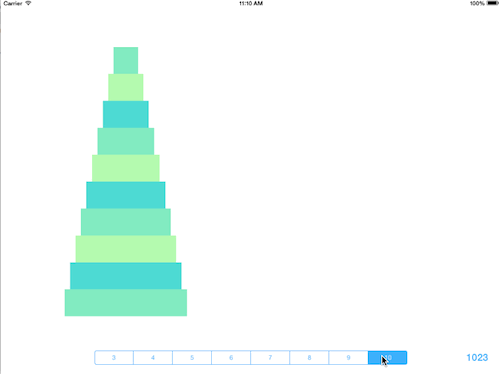

## Submission for [Coder Night 2014-06](http://www.meetup.com/CoderNight/events/187545552/)

This is my first Swift program. I initially implemented this solution for the [Tower of Hanoi
puzzle](http://en.wikipedia.org/wiki/Tower_of_Hanoi)
using an iterative approach, then a recursive one. My goal was
primarily to learn about Swift.



### Building and Running

Unfortunately for now, you need Xcode 6 Beta to build and run the project,
and this requires an iOS developer subscription. Since there may not be
any other members who can build and test my code, I'll be glad to talk about it
if the group wants me to.

This was built using Xcode 6 Beta 2. Run the tests via ⌘U, run the app via ⌘R.

### Issue: Array is pass-by-value

The biggest problem I ran into was getting used to Array being implemented as a
struct instead of a class, which means it's passed by value instead of by
reference. So doing the following becomes a problem:

```swift
var stackA, stackB, stackC: Array<Int>
var board = [stackA, stackB, stackC]
```

The board variable receives a copy of the stackX variables. When any of these
arrays change, the arrays referenced by board are copied. The copy doesn't
occur immediately for performance reasons (i.e. a lazy copy).

I initially implemented stack functions by creating an extension on Array like
this:

```swift
extension Array {
    mutating func push(item: T) {
        append(item)
    }

    mutating func pop() -> T? {
        return (count > 0 ? removeLast() : nil)
    }

    func peek() -> T? {
        return (count > 0 ? self[count-1] : nil)
    }
}
```

This solution caused problems when I expected "board" to reflect the current
values of its member arrays. So instead, I created a Stack class which implements an internal array,
thus all Stack objects are passed by reference which is how most OO programmers
are used to working with arrays. Note: when passing an array into a function, the
compiler will raise an error if you attempt to mutate it. You can add
"inout" before the parameter name to let the compiler know you intend to mutate
the parameter array contents and expect the variable passed as a parameter to reflect any mutations.

### Issue: Type safety == very picky compiler

In short, Float != CGFloat and Double is not compatible with Float for math
operations. Complicating things are differences in compilation for 32-bit and
64-bit platforms. I still don't understand all the issues but the forums
are full of complaints regarding this. Swift is very much a work in progress so
I expect this will be addressed in the future.

Note: for this reason, the app in its current state will compile for
iPad 2 and iPad Retina but not iPad Air.
